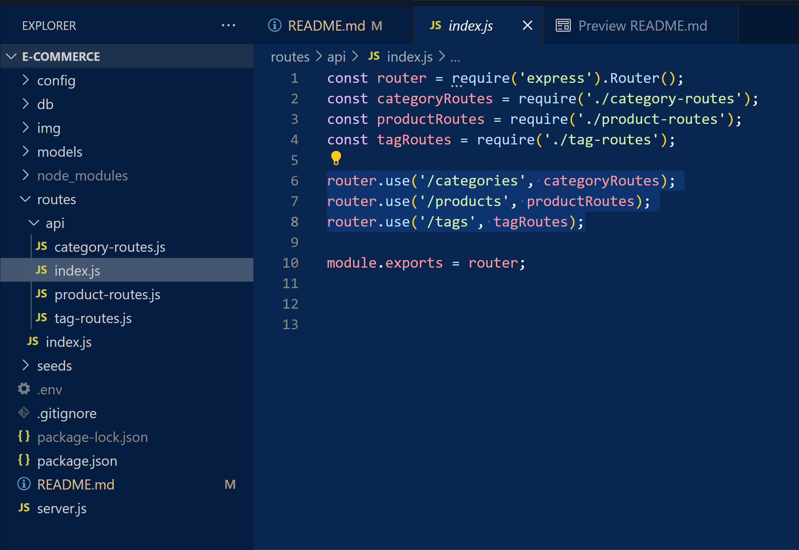

# E-Commerce Back-End Functionality 
 

## Discription
E-commerce is vital to the growth and developement of online businesses throughout the world. As a developer its essential to understand how to provide a SQL database that is functional in real time. In this project I do by focusing on the ability to create, read, update, and delete data from a potential E-commerce website. This is a backend focused project, and as such it was focused on setting up the correct models, schema, routes, connection, and seeds.

## Table of Contents

- [Installation](#installation-processes)
- [Usage](#app-usage)
- [Tests](#testing)
- [License](#license)
- [contributors](#contributors)

## Installation Processes
There are no steps required to install this project. However, to utilize its functionality for the purpose of this project, one should have Insomnia or another API client installed on their computer. This will allow the individual to test the routes provided, and ensure that they can create, read, update, and delete data inside of the SQL databases.

## App Usage
To use this project, have an API client such as Insomnia installed on your computer. Launch your API client, then open the E-Commerce project in VS code, on your personal device. Open the integrated terminal in the server.js file and input "npm run start" into the terminal. Open Insomnia, and create a new collection with a name of your choosing, for ex: "E-Commerce". Inside that folder, add three other folders called "Tag", "Product", and "Category", these folders will have files inside used to test CRUD routes related to each of the three api routes, "tag-routes", "product-routes", and "category-routes". The end "product" inside of your Insomnia should look like this:

  

 

To ensure that you are using the correct file paths as your URL links in Insomnia, refer to the "index.js" file located in the "routes" -> "api" folders. View the pictures highligthed file paths below to use in your own URL paths.

  

 

## Video of Working Back-End Functionality

<video width="600" controls>
  <source src="img/E-Commerce-Assign.mp4" type="video/mp4">
  Your browser does not support the video tag.
</video>

## License
This project is licensed under MIT's permissive software license.

## Contributors
This project wouldnt have been possible without the help and guidence from my professor, prosfessor's assistant, and tutors provided by ASU's coding bootcamp

## Questions
If you have any questions about the repo, contact me directly at Trevor9J@Protonmail.com. If you want to see more of my work, please visit my [GitHub](https://github.com/trevorsdev). To visit this specific project repository on my GitHub, please visit this [link.](https://github.com/trevorsdev/E-Commerce)
